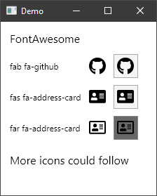

# Icons.Avalonia
A library to easily display icons in an Avalonia App.


## NuGet
| Name | Description | Version |
|:-|:-|:-|
| [Projektanker.Icons.Avalonia](https://www.nuget.org/packages/Projektanker.Icons.Avalonia/) | Core library |  |
| [Projektanker.Icons.Avalonia.FontAwesome](https://www.nuget.org/packages/Projektanker.Icons.Avalonia.FontAwesome/) | [Font Awesome Free](https://fontawesome.com) |  |


## Usage
A full example is available in the [demo](demo) directory or at the bottom of this readme.

### 1. Register icon providers on app start up
Use the `AppBuilder.AfterSetup` method to register a callback. Within this callback register the icon prodider(s). Otherwise the visual designer won't be able to use the registered icon provider(s).
```csharp
class Program
{
    // Initialization code. Don't use any Avalonia, third-party APIs or any
    // SynchronizationContext-reliant code before AppMain is called: things aren't initialized
    // yet and stuff might break.
    public static void Main(string[] args)
    {
        BuildAvaloniaApp()
            .StartWithClassicDesktopLifetime(args);
    }

    // Avalonia configuration, don't remove; also used by visual designer.
    public static AppBuilder BuildAvaloniaApp()
    {
        return AppBuilder.Configure<App>()
                .AfterSetup(AfterSetupCallback)
                .UsePlatformDetect()
                .LogToDebug();
    }
    
    // Called after setup
    private static void AfterSetupCallback(AppBuilder appBuilder)
    {
        // Register icon provider(s)
        IconProvider.Register<FontAwesomeIconProvider>();
    }
}
```

### 2. Add xml namespace

Add `xmlns:i="clr-namespace:Projektanker.Icons.Avalonia;assembly=Projektanker.Icons.Avalonia"` to your view.

### 3. Use the icon
Example: The GitHub icon.  
[FontAwesome](https://fontawesome.com/icons/github?style=brands)
```html
<i class="fab fa-github"></i>
```

**Standalone**
```xaml
<i:Icon Value="fab fa-github" />
```

**Attached**
```xaml
<Button i:Attached.Icon="fab fa-github" />
```

### Done

Screenshot  


## Implement your own Icon Provider
Just implement the `IIconProvider` interface:
```csharp
namespace Projektanker.Icons.Avalonia
{
    /// <summary>
    /// Represents an icon provider.
    /// </summary>
    public interface IIconProvider
    {
        /// <summary>
        /// Gets the prefix of the <see cref="IIconProvider"/>.
        /// </summary>
        string Prefix { get; }

        /// <summary>
        /// Gets the SVG path of the requested icon using the registered icon providers.
        /// </summary>
        /// <param name="value">The value specifying the icon to return it's path from.</param>
        /// <returns>The path of the icon.</returns>
        /// <exception cref="System.Collections.Generic.KeyNotFoundException">The icon associated
        /// with the specified <paramref name="value"/> does not exists.</exception>
        string GetIconPath(string value);
    }
}
```
and register it with the `IconProvider`:
```csharp
IconProvider.Register<MyCustromIconProvider>()
```
or
```csharp
IIconProvider provider = new MyCustomIconProvider(/* custom ctor arguments */);
IconProvider.Register(provider);
```

The `IIconProvider.Prefix` property have to be unique within all registered providers. It is used to select the right provider. E.g. `FontAwesomeIconProvider`'s prefix is `fa`.
