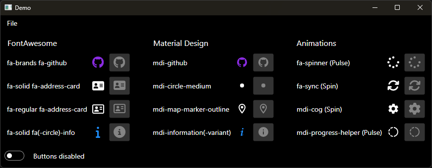

# Icons.Avalonia
A library to easily display icons in an Avalonia App.


## NuGet
| Name | Description | Version |
|:-|:-|:-|
| [Projektanker.Icons.Avalonia](https://www.nuget.org/packages/Projektanker.Icons.Avalonia/) | Core library |  |
| [Projektanker.Icons.Avalonia.FontAwesome](https://www.nuget.org/packages/Projektanker.Icons.Avalonia.FontAwesome/) | [Font Awesome Free](https://fontawesome.com) |  |


## Usage
A full example is available in the [demo](demo) directory or at the bottom of this readme.

### 1. Register icon providers on app start up
Use the `AppBuilder.AfterSetup` method to register a callback. Within this callback register the icon prodider(s). Otherwise the visual designer won't be able to use the registered icon provider(s).
```csharp
class Program
{
    // Initialization code. Don't use any Avalonia, third-party APIs or any
    // SynchronizationContext-reliant code before AppMain is called: things aren't initialized
    // yet and stuff might break.
    public static void Main(string[] args)
    {
        BuildAvaloniaApp()
            .StartWithClassicDesktopLifetime(args);
    }

    // Avalonia configuration, don't remove; also used by visual designer.
    public static AppBuilder BuildAvaloniaApp()
    {
        return AppBuilder.Configure<App>()
                .AfterSetup(AfterSetupCallback)
                .UsePlatformDetect()
                .LogToDebug();
    }
    
    // Called after setup
    private static void AfterSetupCallback(AppBuilder appBuilder)
    {
        // Register icon provider(s)
        IconProvider.Register<FontAwesomeIconProvider>();
    }
}
```

### 2. Add xml namespace

Add `xmlns:i="clr-namespace:Projektanker.Icons.Avalonia;assembly=Projektanker.Icons.Avalonia"` to your view.

### 3. Use the icon
Example: The GitHub icon.  
[FontAwesome](https://fontawesome.com/icons/github?style=brands)
```html
<i class="fab fa-github"></i>
```

**Standalone**
```xaml
<i:Icon Value="fab fa-github" />
```

**Attached**
```xaml
<Button i:Attached.Icon="fab fa-github" />
```

### Full example
Progamm.cs
```csharp
using Avalonia;
using Avalonia.Logging.Serilog;
using Projektanker.Icons.Avalonia;
using Projektanker.Icons.Avalonia.FontAwesome;

namespace Demo
{
    class Program
    {
        // Initialization code. Don't use any Avalonia, third-party APIs or any
        // SynchronizationContext-reliant code before AppMain is called: things aren't initialized
        // yet and stuff might break.
        public static void Main(string[] args)
        {
            BuildAvaloniaApp()
                .StartWithClassicDesktopLifetime(args);
        }

        // Avalonia configuration, don't remove; also used by visual designer.
        public static AppBuilder BuildAvaloniaApp()
        {
            return AppBuilder.Configure<App>()
                    .AfterSetup(AfterSetupCallback)
                    .UsePlatformDetect()
                    .LogToDebug();
        }

        // Called after setup
        private static void AfterSetupCallback(AppBuilder appBuilder)
        {
            // Register icon provider(s)
            IconProvider.Register<FontAwesomeIconProvider>();
        }
    }
}
```

MainWindow.axaml
```xaml
<Window xmlns="https://github.com/avaloniaui"
        xmlns:x="http://schemas.microsoft.com/winfx/2006/xaml"
        xmlns:d="http://schemas.microsoft.com/expression/blend/2008"
        xmlns:mc="http://schemas.openxmlformats.org/markup-compatibility/2006"
        xmlns:i="clr-namespace:Projektanker.Icons.Avalonia;assembly=Projektanker.Icons.Avalonia"
        mc:Ignorable="d" d:DesignWidth="800" d:DesignHeight="450"
        x:Class="Demo.MainWindow"
        Title="Demo">
    <Window.Styles>
        <Style Selector="TextBlock">
            <Setter Property="VerticalAlignment" Value="Center"/>
            <Setter Property="Grid.Column" Value="0"/>
            <Setter Property="Margin" Value="5"/>
        </Style>
        <Style Selector="i|Icon">
            <Setter Property="FontSize" Value="24"/>
            <Setter Property="Grid.Column" Value="1"/>
            <Setter Property="Margin" Value="5"/>
        </Style>
        <Style Selector="Button">
            <Setter Property="FontSize" Value="24"/>
            <Setter Property="Grid.Column" Value="2"/>
            <Setter Property="Margin" Value="5" />
        </Style>
        <Style Selector="Button i|Icon">
            <Setter Property="Margin" Value="0" />
        </Style>
    </Window.Styles>
    <Grid RowDefinitions="Auto,Auto,Auto"  Margin="4">
        <!--Font Awesome-->
        <Grid RowDefinitions="Auto, Auto, Auto, Auto" ColumnDefinitions="Auto, Auto, Auto" Margin="4">
            <TextBlock Text="FontAwesome" Grid.Row="0" Grid.ColumnSpan="2" FontSize="{StaticResource FontSizeLarge}"/>
            <!--GitHub-->
            <TextBlock Text="fab fa-github" Grid.Row="1"/>
            <i:Icon Value="fab fa-github" Grid.Row="1" />
            <Button i:Attached.Icon="fab fa-github" Grid.Row="1" />

            <!--Address Card-->
            <TextBlock Text="fas fa-address-card" Grid.Row="2" />
            <i:Icon Value="fas fa-address-card" Grid.Row="2"/>
            <Button i:Attached.Icon="fas fa-address-card" Grid.Row="2" />
            
            <TextBlock Text="far fa-address-card" Grid.Row="3" />
            <i:Icon Value="far fa-address-card" Grid.Row="3"/>
            <Button i:Attached.Icon="far fa-address-card" Grid.Row="3" />
        </Grid>
        <!--More icons could follow-->
        <Grid RowDefinitions="Auto, Auto, Auto, Auto" ColumnDefinitions="Auto, Auto, Auto" Margin="4" Grid.Row="1" >
            <TextBlock Text="More icons could follow" Grid.Row="0" Grid.ColumnSpan="2"  FontSize="{StaticResource FontSizeLarge}"/>
            
        </Grid>
    </Grid>
</Window>
```

Screenshot  

